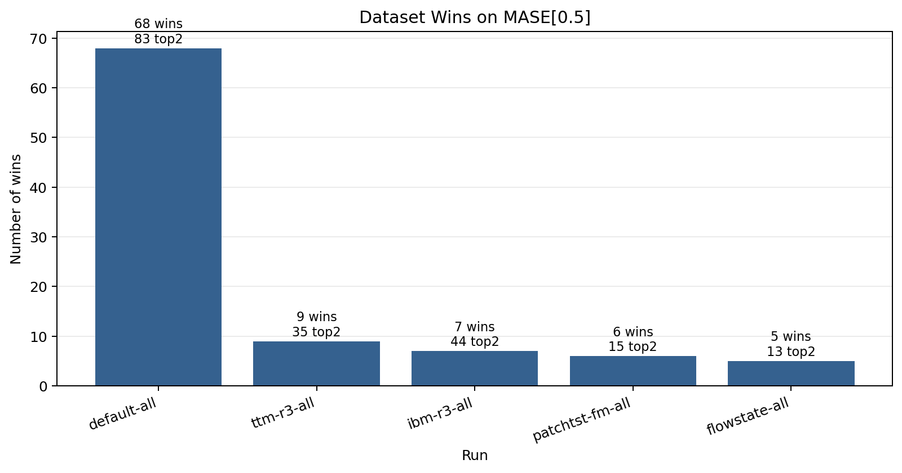
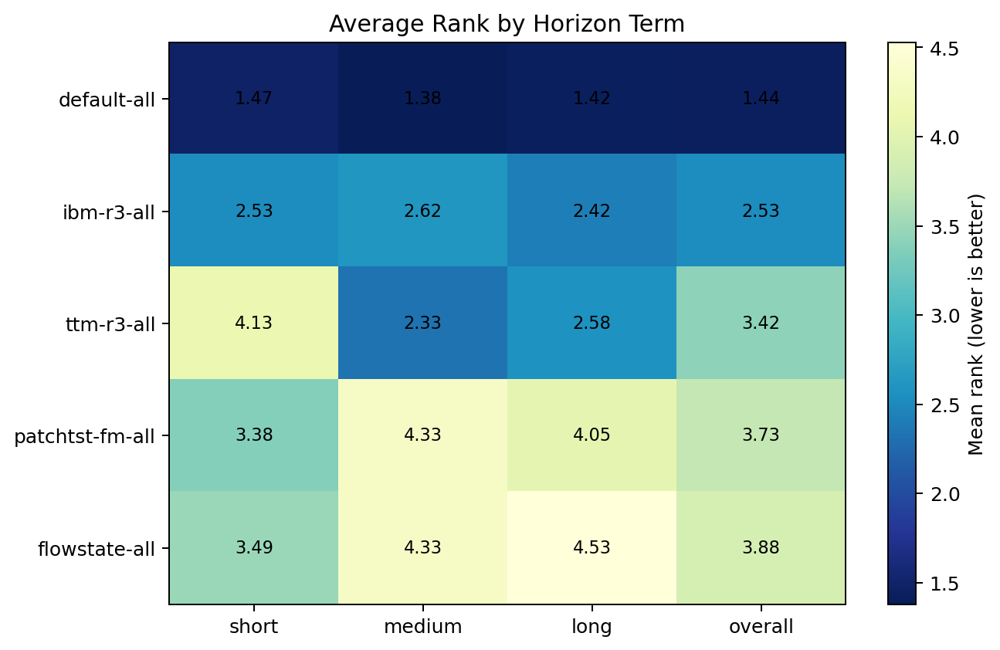
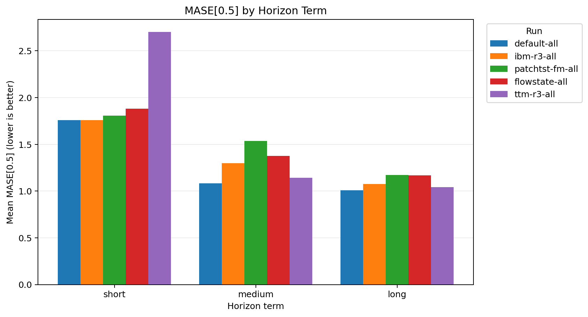

# TimeCopilot Ensemble Comparison

## Executive Summary

- `default-all` is the strongest overall configuration in this comparison, with the best mean `eval_metrics/MASE[0.5]` and `eval_metrics/mean_weighted_sum_quantile_loss`.
- `default-all` records the most per-dataset wins on `eval_metrics/MASE[0.5]` (68 of 95 common datasets).
- `default-all` is the most consistent run by average per-dataset rank (1.442).
- The default TimeCopilot stack outperforms the IBM R3 ensemble and the single-model baselines in this refreshed comparison.

## Runs Compared

- `default-all`
- `ibm-r3-all`
- `flowstate-all`
- `patchtst-fm-all`
- `ttm-r3-all`

## Overall Summary

| run_name        | model           |   eval_metrics/MASE[0.5] |   eval_metrics/mean_weighted_sum_quantile_loss |   eval_metrics/MAE[0.5] |   eval_metrics/RMSE[mean] |   n_datasets |
|:----------------|:----------------|-------------------------:|-----------------------------------------------:|------------------------:|--------------------------:|-------------:|
| default-all     | TimeCopilot     |                  1.47612 |                                       0.202318 |                 538.513 |                   3101.67 |           97 |
| ibm-r3-all      | TimeCopilot-IBM |                  1.54998 |                                       0.214378 |                 549.015 |                   2974.68 |           97 |
| flowstate-all   | FlowState       |                  1.64117 |                                       0.232145 |                 516.287 |                   2756.45 |           97 |
| patchtst-fm-all | PatchTST-FM     |                  1.67304 |                                       0.228007 |                 548.509 |                   3135.61 |           97 |
| ttm-r3-all      | TTM-R3          |                  2.02548 |                                       0.308846 |                1216.53  |                   8685.45 |           95 |

## Fairness-Aware Ranking

These views are computed on the common dataset intersection across the included runs.

| run_name        | model           |   n_datasets |   wins |   top2 |   mean_rank |   median_rank |
|:----------------|:----------------|-------------:|-------:|-------:|------------:|--------------:|
| default-all     | TimeCopilot     |           95 |     68 |     83 |     1.44211 |             1 |
| ibm-r3-all      | TimeCopilot-IBM |           95 |      7 |     44 |     2.52632 |             3 |
| ttm-r3-all      | TTM-R3          |           95 |      9 |     35 |     3.42105 |             4 |
| patchtst-fm-all | PatchTST-FM     |           95 |      6 |     15 |     3.72632 |             4 |
| flowstate-all   | FlowState       |           95 |      5 |     13 |     3.88421 |             4 |

## Performance by Horizon

| run_name        | model           |   short |   medium |    long |   overall_mean_rank |
|:----------------|:----------------|--------:|---------:|--------:|--------------------:|
| default-all     | TimeCopilot     | 1.47273 |  1.38095 | 1.42105 |             1.44211 |
| ibm-r3-all      | TimeCopilot-IBM | 2.52727 |  2.61905 | 2.42105 |             2.52632 |
| ttm-r3-all      | TTM-R3          | 4.12727 |  2.33333 | 2.57895 |             3.42105 |
| patchtst-fm-all | PatchTST-FM     | 3.38182 |  4.33333 | 4.05263 |             3.72632 |
| flowstate-all   | FlowState       | 3.49091 |  4.33333 | 4.52632 |             3.88421 |

## Visual Summary

### Dataset Wins

How to read:
- Taller bars mean the run is the best on more datasets when ranked by `MASE[0.5]`.
- The annotation above each bar shows outright wins and top-2 finishes.
- This plot is good for spotting specialist runs that win often but may still be unstable overall.

### Average Rank by Term

How to read:
- Lower values are better.
- Each cell shows the average per-dataset rank for that run within a horizon group.
- Darker cells indicate stronger relative performance.
- This plot is useful for checking whether a run is strongest on `short`, `medium`, or `long` tasks.

### Primary Metric by Term

How to read:
- Each group compares runs within `short`, `medium`, and `long` datasets using the actual mean `MASE[0.5]` value.
- Lower bars are better.
- This plot complements the rank heatmap by showing effect size, not just ordering.

## Key Observations

- `default-all` is the strongest overall run on both point and probabilistic metrics in this comparison.
- `default-all` is also the most consistent run by average per-dataset rank, so the same configuration leads on both aggregate quality and stability.
- `ibm-r3-all` is best on the short-horizon mean `MASE[0.5]` view.
- `default-all` is best on the medium-horizon mean `MASE[0.5]` view.
- `default-all` is best on the long-horizon mean `MASE[0.5]` view.
- `ibm-r3-all` remains the strongest challenger, but it is clearly behind `default-all` once the comparison is restricted to these five runs.
- `ttm-r3-all` is still informative as a specialist baseline: it is weak overall, but materially stronger on medium and long horizons than on short horizons.
- `patchtst-fm-all` and `flowstate-all` remain useful single-model references, but neither is competitive with the two ensemble configurations on the main aggregate views.
- The wins plot and the rank heatmap are useful together because they separate broad consistency from more specialized strengths.

## Suggested Discussion Points

- Whether `default-all` should now be treated as the primary recommended TimeCopilot configuration for broad use.
- Whether `ibm-r3-all` is still worth keeping as a simpler IBM-only ensemble baseline for future ablations.
- Whether the horizon-specific behavior of `ttm-r3-all` suggests an opportunity for routing or conditional ensembling rather than uniform use.

## Appendix

- Detailed per-dataset comparisons are available in `comparison_appendix.csv`.
- Win counts are available in `comparison_win_counts.csv`.
- Rank-by-term details are available in `comparison_avg_rank_by_term.csv`.
